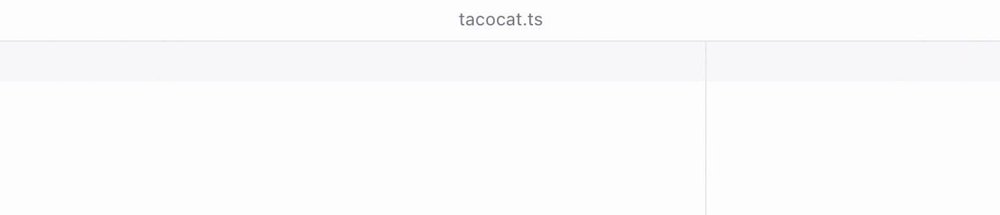
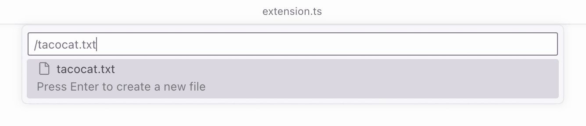

# New File Now 🆕

Create new files and directories quickly using the command palette.

**[Install from Visual Studio Marketplace](https://marketplace.visualstudio.com/items?itemName=sapegin.new-file-now)**

_Inspired by the awesome [AdvancedNewFile extension](https://github.com/SublimeText/AdvancedNewFile) for Sublime Text._

## How it works?

1. Press the hotkey: <kbd>Cmd</kbd>+<kbd>Alt</kbd>+<kbd>N</kbd> on Mac or <kbd>Ctrl</kbd>+<kbd>Alt</kbd>+<kbd>N</kbd> on Windows.

2. Type a path to a file or a folder you want to create, relative to the currently open file.

3. Press <kbd>Enter</kbd>.

## Features

Creates all the necessary nested folders, and opens the created file in the editor:

**To create a folder**, append `/` to the path. For example, `taco/cat/`:

**To go up the file tree**, start the path with `../`. For example, `../tacocat.txt`:

**To create a file or folder in the workspace root**, start the path with `/`. For example, `/tacocat.txt`:

## Settings

You can [redefine the key bindings](https://code.visualstudio.com/docs/getstarted/keybindings):

| Description | Name | Default Mac | Default Windows |
| --- | --- | --- | --- |
| Create new file | `newFileNow.createNewFile` | <kbd>Cmd</kbd>+<kbd>Alt</kbd>+<kbd>N</kbd> | <kbd>Ctrl</kbd>+<kbd>Alt</kbd>+<kbd>N</kbd> |

## Changelog

The changelog can be found on the [Changelog.md](./Changelog.md) file.

## How is it different from other extensions?

There are plenty of similar extensions (like [this](https://marketplace.visualstudio.com/items?itemName=patbenatar.advanced-new-file) or [this](https://marketplace.visualstudio.com/items?itemName=dkundel.vscode-new-file)) but they are either broken, or confusing. I wanted something that’s easy to use, efficient, simple, and has great UX. Also, they weren’t updated in years and don’t use new Visual Studio Code’s APIs.

## How is it different from New Text File and New File… commands?

Visual Studio Code has several options to create new files:

* File → New Text File (Cmd+N): creates an anonymous file, to save it you’d need to use the system file dialog and create all the folders manually.
* File → New File (Cmd+Ctrl+Alt+N): shows a similar to the New File Now quick picker dialog, but it has a confusing UX because it’s unclear where the new file is going to be created, and it opens a system file dialog on the next step, which is even more confusing…
* `explorer.newFile` (no key binding by default): creates a new file in the current folder, supports nesting and creating folders. This is close but the UX is still not as good for my taste.

All these methods are confusing and unproductive, and don’t give the user enough clarity on what’s going to happen. Most don’t create folders, and don’t respect the folder of the currently open file. The New File Now extension doesn’t have these issues.

## You may also like

Check out my other Visual Studio Code extensions:

- [Emoji Console Log](https://marketplace.visualstudio.com/items?itemName=sapegin.emoji-console-log): insert `console.log()` statements with a random emoji
- [Todo Tomorrow](https://marketplace.visualstudio.com/items?itemName=sapegin.todo-tomorrow): highlight `TODO`, `HACK`, `FIXME`, etc. comments
- [Squirrelsong Light Theme](https://marketplace.visualstudio.com/items?itemName=sapegin.Theme-SquirrelsongLight): low contrast non-distracting light theme for web developers
- [Squirrelsong Dark Theme](https://marketplace.visualstudio.com/items?itemName=sapegin.Theme-SquirrelsongDark): low contrast non-distracting dark theme for web developers

## Sponsoring

This software has been developed with lots of coffee, buy me one more cup to keep it going.

## Contributing

Bug fixes are welcome, but not new features. Please take a moment to review the [contributing guidelines](Contributing.md).

## Authors and license

[Artem Sapegin](https://sapegin.me), and [contributors](https://github.com/sapegin/vscode-new-file-now/graphs/contributors).

MIT License, see the included [License.md](License.md) file.
